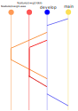

# 1. リリース運用ルール(作成中)
---

## 1.1. 各ブランチ説明
|ブランチ名|説明|
| --- | ---|
| main | 公開用ブランチ。mainブランチへの編集およびマージはリリース責任者のみによって行なわれる。|
| develop | 開発用ブランチ。developブランチへの編集およびマージはSWG責任者以上の権限を必要とする。|
| feature/xxxxx | 機能追加の際の作業用ブランチ。developブランチから分岐し、SWGメンバ権限以上にて作成および編集し、作業を行う。featureブランチのDevelopへの反映はSWG責任者以上権限のマージによって行なわれる。SWGメンバは作業が終わるとSWG責任者以上に対してマージを依頼する。依頼する手段としてはPull Requestを推奨する。|

## 1.2. 各アクタ説明
|役割|チーム名|説明|
|---|---|---|
|リリース責任者|FHIR-swg leaders|mainブランチに対するマージや、releaseのタグ付けを行なう。<br/>fshファイルに対するversion,statusの一括変更等を行なう。|
|SWG責任者|FHIR-swg editor|developブランチの更新、featureブランチ→developブランチへのマージを実施する。各SWGにて１名以上メンバを立てること。|
|SWGメンバ|FHIR-swg member|featureブランチに対する修正およびdevelopに対するPullRequestを行なうことができる。|
|FHIR WG以外| 無所属 | 外部メンバから指摘を受ける場合、Forkを利用してもらいDevelopに対するPull Requestのみを受け付ける。|

## 1.3. 修正の流れ

1. 「リリース責任者」によりmainブランチよりdevelopに分岐を事前に作成する。
1. 「SWGメンバ(SWG1)」は、developブランチよりfeature/swg1-aaaのブランチを作成し、このブランチ上で編集を行う。
1. 「SWGメンバ(SWB2)」は、developブランチよりfeature/swg2-bbbのブランチを作成し、このブランチ上で編集を行う。
1. 「SWGメンバ(SWG1)」は、修正が完了すると、developへのプルリクエストを発行する。
1. 「SWG編集責任者(SWG1)」は、Pull Requestの修正内容および自動ビルドの結果を確認し、developブランチに対してマージを行なう。
1. 「SWGメンバ(SWG2)」は、修正が完了すると、developへのプルリクエストを発行する。
1. 「SWG編集責任者(SWG2)」は、Pull Requestの修正内容および自動ビルドの結果を確認し、developブランチに対してマージを行なう。
1. 「リリース責任者」は、外部向けに公開する準備が整った段階でdevelopブランチの内容をmainブランチにマージを行なう。

## 1.4. コンフリクト（衝突）発生時の対処
* 複数ブランチにより同時に同じファイルを修正するとコンフリクト（衝突）が発生する。
* 先勝ちルールであり後からマージする側が解決する。
* Pull Request作成者は、発行時にコンフリクトが発生していないかを確認し、コンフリクト解消後にPull Requestを発行すること。

## 1.5. featureブランチ命名規則
現在どのような修正を行なっているのかを分かりしやすくするため、ブランチ名の一部にSWG名称を一部入れることとする。

|対象| 命名規則 | サンプル |
|---|---|---| 
| SWG内修正 | feature/swg[1-6]-(修正内容) | feature/swg1-github説明方法修正| 
| 複数SWG修正 | feature/swg[1-6]+-(修正内容) | feature/swg46-procedure用語集の修正 |
| SWGに属さない修正 | feature/ext-(修正内容) | feature/ext-GitHubAction修正 |

## 1.6. その他
* Pull Request発行時に、ビルド結果を確認できる。
* ビルド結果は、github readmeページより確認できる。
* 警告の内容を確認し、警告が増えていないかを確認する。

----
# 2. アカウント申請

##  2.1. 編集に必要な権限
FHIR WGメンバにて編集を行なう場合、下記の権限が必要になります。
下記より申請を行なってください。

* github アカウント
* github Organization(jami-fhir-jp-wg)への所属
* github Team(SWG責任者、SWGメンバのいずれか)への所属

FHIR WG以外メンバからは、部外者のFork & pull requestも受け付けますが、

## 申請手順
1. 事前にgithubのアカウントを生成すること。
1. slackの「git-jpcorev1x」に参加する。
1. 同チャネルにて以下のメッセージを入力する。
``` slack
@channel アカウント申請
-------------------------------------------
既存GitHub Acount：(xxx部分はgithub acountを入力)
xxx 
役割：(希望する役割を残す)
SWG責任者 or SWGメンバ
-------------------------------------------
```
