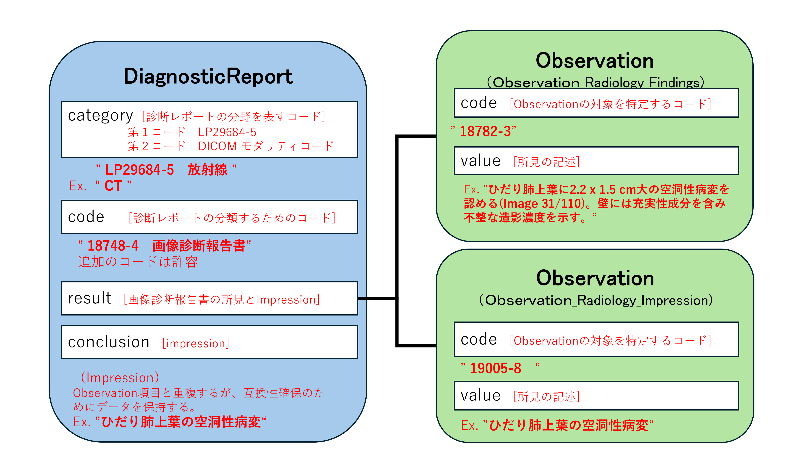

### 必須要素

次のデータ項目は必須（**SHALL**）である。

- identifier ： レポートの識別子　
- status : レポートの状態・進捗状況
- code : レポートの種別
  （[JP Core Document Codes Diagnostic][JP_DocumentCodes_DiagnosticReport_VS]に記載されているLOINCコード(18748-4) "Diagnostic imaging study" を指定）
- category : カテゴリとモダリティを表すコード
  （Radiology(LP29684-5)を第一コードとし、モダリティを示すDICOMコードを第二コードとして指定する。第二コードは複数のモダリティを許容するため、複数のコードの指定が想定される。）
  
### MustSupport

次のデータは送信システムに存在する場合はサポートされなければならないことを意味する（Must Support）。

- _text : レポートの所見を含むnarrativeデータ（簡易表示に用いられる）
- basedOn : レポートあるいは画像検査のServiceRequest
- subject : 患者リソース(Patient)への参照。殆どの場合存在するが、緊急検査等で患者リソースが確定していない場合が想定される
- effectiveDateTime : レポート作成日時
- issued : レポート確定日時
- performer : Practitionerでレポートの関係者（作成者、読影者、確定者など）を列挙
- resultInterpreter : Practitionerでレポート確定者を示す
- imagingStudy : 診断の対象となる画像
- result ： 所見(findings)や診断の結果(impression) を示すObservationリソースへの参照。
- link : キーイメージの参照先
- conclusion : 診断の結果、impression
- presentedForm : レポート本体（全体のイメージあるいは所見等のテキスト）

imagingStudyエレメントはCardinalityが0..*で 0 が許容されているが、放射線レポートでは画像が必ず存在することから、検査実施後には必須（複数の可能性もあり）である。

### Extensions定義

 本プロファイルで追加定義された拡張はない。

## 注意事項

### Text
JP Core V1.2からは、診断、所見などの観察結果についてはDomainResourceのtext要素ではなく、原則としてresult要素が参照するObservationリソースに格納する方針に改めたので注意されたい。

依頼情報や患者基本情報などを含むレポート全体のデータは、presentedForm要素に、base64で符号化されたバイナリデータとして格納される。そこで、所見を中心としたhuman-readableな[narrative](https://www.hl7.org/fhir/R4/narrative.html)データを、主にレポートの見読性と検索性の向上を目的に、JP Core V1.1.2ではDiagnosticReportのDomainResourceの1つであるtext要素に格納することを推奨することとして本プロファイルを初期リリースした。
(レポートの詳細はpresentedForm要素に格納されるレポート本体での確認を前提とする)

しかし、多くのクラウドシステムではDomainResource.textを検索対象とできない可能性があることが判明したため、JP Core V1.2以降では、V1.1.2での実装から方針を転換し、US Coreの運用方法に倣い、DiagnosticReport.result要素が参照する[JP Core Observation Radiology Findings][JP_Observation_Radiology_Findings]リソースおよび[JP Core Observation Radiology Impression][JP_Observation_Radiology_Impression]に、診断レポートの一部となる観察結果（診断、所見など）の情報を記載し、検索対象のリソースとして用いることとした。

従って、V1.2以降では、.text要素に記述した内容はレポートの内容に対する簡易的な表示には利用されるが、サーバ上での検索性は担保されない可能性を考慮して実装することを推奨する。
また、所見(findings)や診断の結果(impression)は対応するObservationリソースに内容が保持されるので、全文検索等の目的で構造化された情報を利用する場合はこれらを参照すること。

<!-- 
 -->


具体的な構造については [**放射線読影レポート**][jp-diagnosticreport-radiology-example-1]を参照のこと

### CategoryとCode

Codeエレメントは一つの値のみが許容される。一方でIVR等の手技で血管造影検査と超音波検査あるいはCT検査が併用されることがあるように、放射線画像検査では複数のモダリティと組み合わせた複合的な検査治療手技が構成されることがある。すべての組み合わせのコードを準備あるいは列挙することは困難であるため、本バージョンの実装ガイドでは放射線検査に対する画像診断レポートにはCodeに 18748-4（画像検査報告書）を指定することを原則としている。
Codeエレメントに利用されるコードとして[JP Core Document Codes Diagnostic][JP_DocumentCodes_DiagnosticReport_VS]	に定義されるコードシステムが用意されているが、粒度の細かいコードはSS-MIX2等で既に定義されているデータとの後方互換を保つ目的で用意されている点に留意が必要である。

Codeエレメントで複合的要素を表現できない点を考慮し、Categoryエレメントにて、複数のモダリティコードを指定できるように設計している点をあわせて確認すること。

### Identifier

Identifier のデータタイプはオーダ依頼者であるPlacerあるいはオーダの実施者であるFiller（HL7 Version 2 Messaging Standardにて'Placer'あるいは'Filler'として知られている）によって割り当てられた識別子を区別するために利用されるtypeエレメントを持っている。typeエレメントは以下の様に利用する。

#### Placerの場合

```json
{
  "identifier":[{
    "type":{
      "coding":{
        "system":"http://terminology.hl7.org/CodeSystem/v2-0203",
        "code":"PLAC"
      },
      "text":"Placer Identifier"
    },
    "system":"http://abc-hospital.local/fhir/PlacerIdentifier",
    "value":"2345234234234"
  }]
}
```

#### Fillerの場合

```json
{
  "identifier":[{
    "type":{
      "coding":{
        "system":"http://terminology.hl7.org/CodeSystem/v2-0203",
        "code":"FILL"
      },
      "text":"Filler Identifier"
    },
    "system":"http://abc-hospital.local/fhir/FillerIdentifier",
    "value":"567890"
  }]
}
```

DiagnosticReport_Radiology リソースではtypeエレメントを明示する際にはオーダ番号やレポート番号が格納される可能性がある点に留意して対応することが重要である。

### 時間の指定

このプロファイルのリソースでは、effective[x]エレメントにはレポート作成時間を[dateTime](https://www.hl7.org/fhir/R4/datatypes.html#dateTime)で格納する。

### 関連するObservation

DiagnosticReport.resultエレメントには所見(findings)や診断の結果(impression)を示すObservationリソースが含まれるが、加えて関連する検体検査や画像上の計測値などをしめすObservationリソースを含むことができる。

### 参照画像

ImagingStudyやmediaは多少オーバーラップするが、使用される目的が異なる。用途に応じて使い分けること。DiagnosticReportではDICOM画像への参照としてImagingStudyが利用され、キー画像としてmediaが参照される。

### 診断報告書のステータス

- 診断レポートを使用するアプリケーションでは、更新された (改訂された) レポートに注意を払い、取り消されたレポートが適切に処理されるようにする必要がある。
- 診断レポートを提供するアプリケーションの場合、レポートはすべての個々のデータ項目が確定あるいは追加され最終的なものになるまで、ステータスを「final」としてはならない。
- 以前の最終リリース後にレポートが取り下げられた場合は、ステータスコードを「entered-in-error (入力済みエラー)」という概念に置き換え、結論/コメント(提供されている場合)およびテキスト(_text)の説明に「このレポートは取り下げられました」などの記述を追加して、DiagnosticReportおよび関連するObservationを撤回する必要がある。撤回の理由をテキストで明示しても良い。

### レポートの内容

典型的には放射線レポートはnarrativeな構成でのレポートが作成される。DiagnosticReport_Radiologyでは標準的なnarrativeリソースの表現としてXHTMLやrich text表現として（典型的にはPDF）がpresentedFormに指定される。

Conclusionやコード化された診断結果は各々がレポートを構成する小さなデータであるが、これらはpresentedFormに保持されるnarrativeなデータ内に含まれると同時に、本リソースのエレメントに複製されなければならない（**SHOULD**）。

診断レポートの所見などnarrativeなデータはDiagnosticReportのドメインリソースとして定義されているtextにも保持すること。presentedFormとの内容の重複は許容されている。presentedFormはbase64のバイナリであるため、DiagnosticReportのtextが見読性の担保に利用される。検索についてはサーバ仕様によりドメインリソースであるtextは検索対象として利用できないことがあるので、resultエレメントに指定されるObservationリソースの内容を対象として考慮すること。

診断レポートの分野はAIによる診断補助やレポートの構造化を含め様々な変革がもたらされている。そのため、上記仕様は現時点でのリソース展開の例示であり、将来的に変更される可能性がある。

## 利用方法

#### 検索パラメータ

本プロファイルで再定義された検索パラメータの一覧である。[DiagnosticReport共通の検索パラメータ][JP_DiagnosticReport_Common]が利用されるが、重複するものについては以下の定義に従うこと。

| コンフォーマンス | パラメータ | 型 | 説明 | 表現型 |　例　|
| --- | --- | --- | --- | --- | --- |
| SHALL | identifier | token  | レポートに割り当てられた識別子 | DiagnosticReport.identifier | GET [base]/DiagnosticReport?identifier=http://myhospital.com/fhir/diagnosticreport-id-system\|1234567890 |
| MAY | based-on | reference | オーダ情報への参照 | DiagnosticReport.basedOn ([ServiceRequest](https://hl7.org/fhir/R4/servicerequest.html)) | GET [base]/DiagnosticReport?ServiceRequest/12345 |
| SHOULD | category | token | レポート種別 | DiagnosticReport.category ([ValueSet]()) <br/> 第1コードは LP29684-5 (Radiology 固定) <br/>第2コード以下は複数のコードを許容し、DICOMモダリティコードが格納される | GET [base]/DiagnosticReport?category=LP29684-5&category=CT |
| SHOULD | code | token | レポート全体を示すコード | DiagnosticReport.code [LOINC 18748-4](https://loinc.org/18748-4/)(固定) | GET [base]/DiagnosticReport?code=18748-4 |
| MAY | media | reference | キー画像への参照 | DiagnosticReport.media.link ([Media](https://www.hl7.org/fhir/R4/media.html)) | GET [base]/DiagnosticReport?media/12345 |
| MAY | result | reference | 所見内容の検索 | 	DiagnosticReport.result ([Observation](JP_Observation_Radiology_Findigs)) | GET [base]/DiagnosticReport?result:Observation.valuestring:contains=肺癌 |

なお、検索パラメータは複合的に利用できる。詳細は[Search - Chained parameters](https://www.hl7.org/fhir/R4/search.html#chaining)を参照すること。

#### 必須検索パラメータ

次の検索パラメータは必須でサポートされなければならない。

1. identifier 検索パラメータを使用して、オーダIDなどの識別子によるDiagnosticReportの検索をサポートしなければならない（**SHALL**）  
```
GET [base]/DiagnosticReport?identifier={system|}[token]
```
例：
```
GET [base]/DiagnosticReport?identifier=http://myhospital.com/fhir/diagnosticreport-id-system|1234567890
```

指定された識別子に一致するDiagnosticReportリソースを含むBundleを検索する。
 
### サンプル

* [**放射線読影レポート**][jp-diagnosticreport-radiology-example-1]

## その他、参考文献・リンク等

本プロファイルそのものの定義には影響しないが、レポートの標準化に関し以下の情報が参考となる。presentedForm に収容するレポートのコンテンツを作成するレポーティングシステムにおいて、標準化に関する参考資料となる。

1. [RadReport][RadReport] - 放射線レポートテンプレート
1. [RadLex radiology lexicon][RadLex radiology lexicon] - 放射線科語彙集
1. [RadElement][RadElement] - 放射線関連共通データエレメント
1. [IHE Radiology Technical Framework][IHE Radiology Technical Framework] - 放射線関連テクニカルフレームワーク（放射線レポートおよびレポートテンプレートの取り扱いに関する仕様が含まれている）



