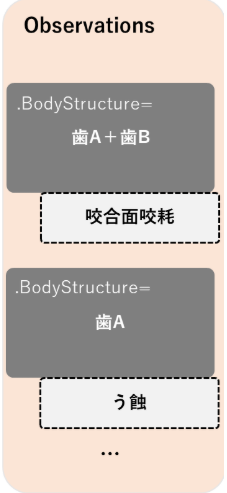

本プロファイルは、複数の部位が同一の疾患を有していたり、複数部位からなる疾患が存在した際に、複数の部位を表現することのできるプロファイルについて、情報の登録や検索、取得のために、FHIR Observationリソースを使用するにあたっての、最低限の制約を記述したものである。 Observation リソースに対して本プロファイルに準拠する場合に必須となる要素や、サポートすべき拡張、用語、検索パラメータを定義する。

## 背景および想定シナリオ

本プロファイルは、以下のようなユースケースを想定している。
　
- 診療情報提供書用に、複数の部位が同一の疾患を有していたり、複数部位からなる疾患が存在した際に、複数の部位を表現することのできるプロファイルを示す

## スコープ

本プロファイルでは上記想定シナリオにて用いられるObservationの用途がスコープであり、診療情報提供書用に、複数の部位が同一の疾患を有していたり、複数部位からなる疾患が存在した際に、複数の部位を表現することを取り扱うために、必要な要件を定義している。

<!-- 
 -->

## プロファイル定義

