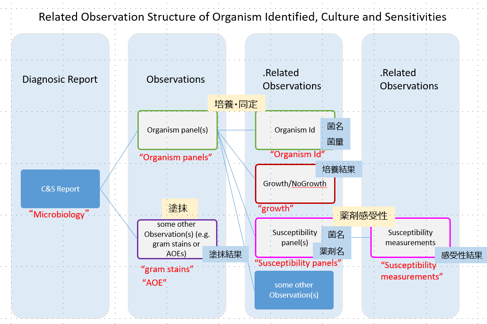

本プロファイル説明は、患者に関連付けられた微生物検査結果を記録、検索、および取得のために、FHIR Observationリソースを使用するにあたっての、最低限の制約を記述したものである。
Observation リソースに対して本プロファイルに準拠する場合に必須となる要素や、サポートすべき拡張、用語、検索パラメータを定義する。

なお、検査結果は、Observationリソースを参照するDiagnosticReportリソースを使用してグループ化および要約されたものである。各Observationリソースは、塗抹、培養・同定、薬剤感受性のネストされた個々の微生物検査と結果値、他の観察結果を参照する。

## 背景および想定シナリオ

本プロファイルは、以下のようなユースケースを想定している。

- 検体採取日、菌名に対し条件に合致する微生物検査情報、または関連する他のリソース（Observationリソースや、Patientリソース等）の参照
- 親リソース（兄弟リソース？）に対する追加項目として菌量を加えた条件に合致する微生物検査情報、または関連する他のリソース（Observationリソースや、Patientリソース等）の参照
- ICT等を目的として、子リソースに対する追加項目として薬剤感受性判定値、感受性有無、薬剤名、材料（採取部位、カテーテル等）、患者情報（病棟／病室＋その先のMedicationDispenseリソースの投薬情報）を加えた条件に合致するる微生物検査情報、または関連する他のリソース（Observationリソースや、Patientリソース等）の参照
- 診療目的として、Patientリソースからの指定された（患者の）検体採取日、依頼日での微生物検査情報の参照

## スコープ

本プロファイルでは上記想定シナリオにて用いられる Observationの用途がスコープであり、特に微生物学的検査に該当する情報項目の１つを取り扱う際に、必要な要件を定義している。

本プロファイルでは微生物学的検査（一般細菌検査及び抗酸菌検査）に関わる複数の情報を一つのグループとして表現するため、一つの情報項目を表現するObservationリソースを必要な情報項目数分用意し、それらを1つにグルーピングして扱う。

具体的には .hasMemberエレメントに対して関連する下位の本プロファイルを適用したObservationリソースを関連づけることでグルーピングを行う。微生物学検査で表現する情報群については、図にて表現されるように、検査結果レポートに相当する JP_DiagnosticReport_Microbiologyに（第0層）に対し、

- 第1層：「培養・同定（Organism panels）」、「塗抹（Gram-stain、または AFB-stains、または Others）」  
- 第2層：「菌名・菌量（Organism Id）」、「培養結果（growth）」、「薬剤感受性（Susceptibility panels）」  
- 第3層：「感受性結果（Susceptibility Measurement）」

という情報要素を表現する本プロファイルを適用したObservationリソースを用意する。それぞれの層では一般微生物学検査または抗酸菌検査を実施した際に得られる以下の情報が収容されることを想定している。
<!-- 
 -->

第1層は微生物学検査で順を追って行なわれる検査種別に対応した情報が収容され、最初に施行される塗抹標本の顕微鏡による鏡検に相当するcategoryである「塗抹（Gram-stain、または AFB-stains、または Others）」と、それに引き続いて行なう培養・同定検査に相当するcategoryである「培養・同定（Organism panels）」から構成される。このうち、「塗抹（Gram-stain、または AFB-stains、または Others）」についてはこの階層で検査結果が収容され、これより下の階層は存在しない。

「培養・同定（Organism panels）」は構成要素として培養・同定された各菌毎の情報を下層に持ち、一般微生物学検査では「菌名・菌量（Organism Id）」及び「薬剤感受性（Susceptibility panels）」が、抗酸菌検査ではそれらに加えて「培養結果（growth）」が下層の情報となる。
このように第2層は第1層の「培養・同定（Organism panels）」の下の階層という位置付けとなり、その構成要素である「菌名・菌量（Organism Id）」は培養された菌の菌名と菌量（定性値または定量値）の情報が一般細菌検査・抗酸菌検査ともに収容される。「薬剤感受性（Susceptibility panels）」は培養・同定検査に引き続いて行われる薬剤感受性検査の結果を示すCategoryである「感受性結果（Susceptibility Measurement）」を下層（第3層）に持つ。

同じく第2層の構成要素である「培養結果（growth）」は主として抗酸菌検査で用いられ、8週間後まで時系列に数回に渡って報告される抗酸菌培養の途中経過報告として培養結果の情報が収容される。
第3層となる「薬剤感受性（Susceptibility panels）」は上位層の培養・同定検査で同定された各菌のうちで薬剤感受性検査の対象となる菌について薬剤、最小発育阻止濃度（MIC）、判定結果の情報が収容される。

現バージョンの本プロファイルでは原虫及びウイルスについては対象として想定していないが、診療報酬点数表に於いては「細菌培養同定検査は、抗酸菌を除く一般細菌、真菌、原虫等を対象として培養を行い、同定検査を行うことを原則とする。」と記載されており、原虫についても微生物学検査の対象に含めることが必要になるケースがあり得ると考えられる。しかしながら現実の検査現場に於いて原虫は鏡検によって同定されているため、「培養・同定（Organism panels）」ではなく「塗抹（Gram-stain、または AFB-stains、または Others）」に結果を収容することが報告書としては適切と考える。

## プロファイル定義

