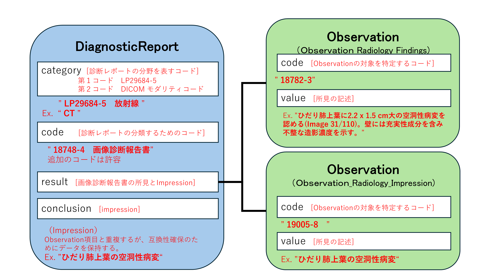

このプロファイルはObservationリソースに対して、放射線画像診断報告書の所見データを送受信するための制約と拡張を定めたものである。
本プロファイルは、放射線画像検査の読影結果を記録、検索、および取得するために、Observationリソースを使用する際の、最低限の制約を記述したものである。Observationリソースに対して本プロファイルに準拠する場合に必須となる要素や、サポートすべき拡張、用語、検索パラメータを定義する。

## 背景および想定シナリオ

本プロファイルは、以下のようなユースケースを想定している。

- 放射線画像検査に対する画像診断報告書の所見の保存
- Patientリソースから指定された日時、期間の、放射線画像検査に対して記述された画像診断報告書の所見の参照
- 放射線画像診断報告書の所見の条件に合致する症例、または関連する他のリソース（Patientリソース、Observationリソース、Procedureリソース等）の参照

## スコープ

本プロファイルでは上記想定シナリオにて用いられるObservationの用途がスコープであり、放射線画像診断報告書の所見を取り扱う際に必要な要件を定義している。
放射線画像診断報告書では所見の他にImpressionが記述されるが、これらは個別のObservationリソースとして表現される。したがって、原則として検査レポート本体に相当するJP Core DiagnosticReport Radiologyの.resultエレメントには所見を表すJP Core Observation Radiology FindingsとJP Core Observation Radiology Impressionが対で含まれることになる。

<!-- 
 -->

## プロファイル定義

